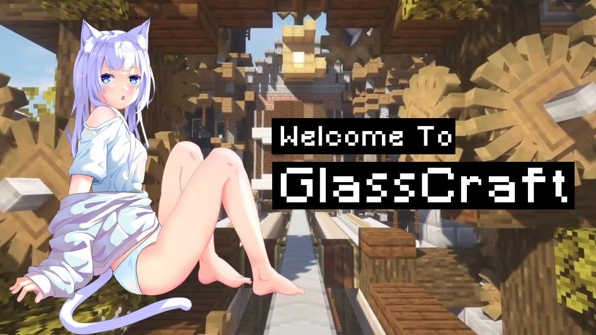

# 琉璃Craft

> 欢迎加入琉璃Craft！

### 游戏内容

琉璃Craft 的模组内容围绕**机械动力**及其附属展开，并添加了**农夫乐事**和 **Terralith** 等原版增强类模组，可以有既具休闲又具挑战的游戏体验。  
基于机械动力，你可以利用庞大的机械完成资源的生产、收集、地形的开拓，搭建宏伟的工厂，也可以建造如 RPG 游戏一般包含各种升降机和机关的建筑。  
同时 Terralith 为服务器中增加了超过85个全新的群系，并用新特色翻新了几乎每个原版生物群系，同时改善它们原来的特点。  
琉璃Craft 提供 **50x50** 的地皮区域大小，进入服务器即可认领您的地皮，开始构造自己的工厂。  
得益于 **FTB Chunks** 模组，您可以在生存区 [圈地](/guide/chunk.md)。鼠标点击地图，即刻划定范围，不花费任何精力。  

### 限制

1. 禁止破坏玩家劳动成果（包括但不限于偷窃、破坏建筑等）
2. 蓄意使用卡服物品导致服务器 TPS 下降

除上述限制之外，你可以做任何事情！

### 加入我们
我们的 QQ 群号：158090858  
您只需要 [下载整合包](download.md)，并在 [皮肤站](https://skin.glasscraft.org) 注册账号后即可加入游戏！