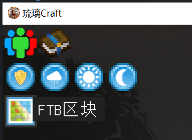

# 圈地
> 您可以在住宅区获得一块地皮，如果您还想在生存世界保护您的任何财产，可以使用**圈地功能**。  

### 圈地方法
打开背包依次点击右上角 `FTB 区块` 和 `认领区块` 进入圈地 GUI 界面。  
  

此处每个区块将以方格的形式划分，只需要**左键点击**即可完成圈地！此外，**右键点击**为取消圈地。

!> 注意：区块上限为16格，请按需圈地，恶意圈地将会被拆除。  

### 加入领地
有时候您可能想让其他玩家拥有自己领地的权限，您需要使用 `团队` 功能。  
打开背包点击右上角 `我的团队`，创建团队并邀请 TA 加入即可。  
